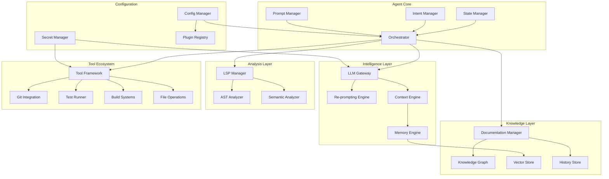
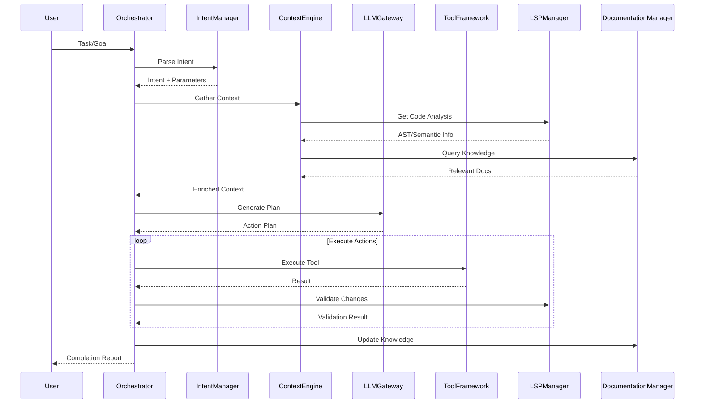
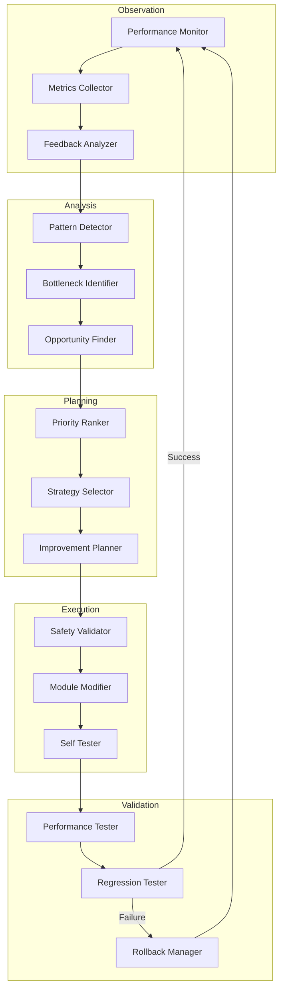
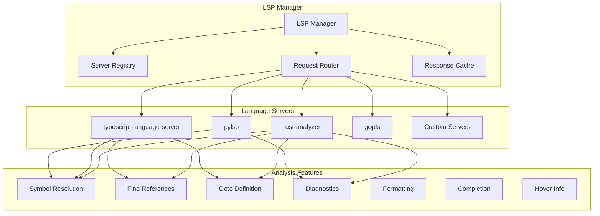
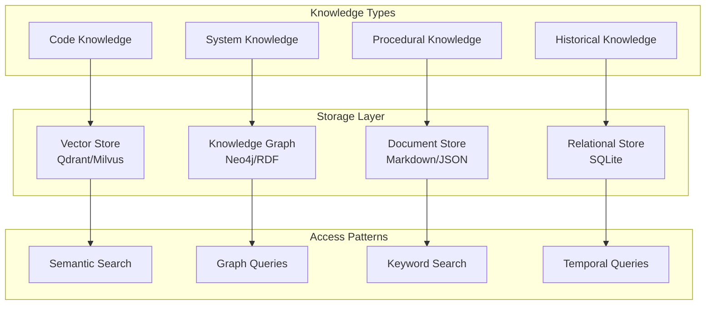
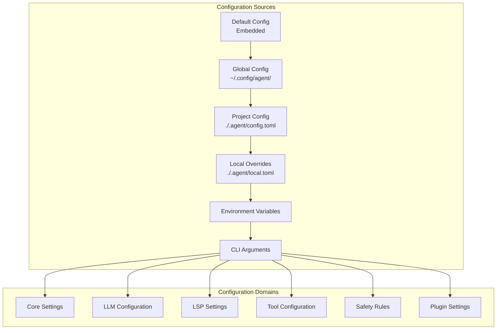
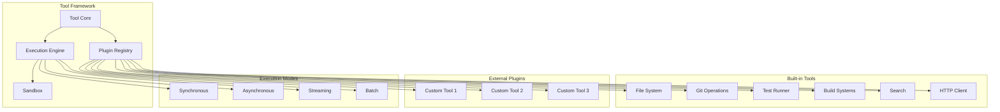
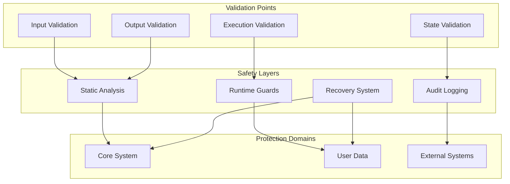

# Self-Developing Coding Agent Architecture

## Table of Contents

1. [Overview](#overview)
2. [High-Level System Design](#high-level-system-design)
3. [Core Modules](#core-modules)
4. [Data Flow](#data-flow)
5. [Self-Improvement Mechanism](#self-improvement-mechanism)
6. [LSP Integration](#lsp-integration)
7. [Documentation & Knowledge Management](#documentation--knowledge-management)
8. [Configuration Architecture](#configuration-architecture)
9. [Tool Integration Framework](#tool-integration-framework)
10. [Safety & Security](#safety--security)
11. [Deployment & Operations](#deployment--operations)

---

## Overview

This document describes the architecture of a self-developing coding agent built in Rust. The agent operates in a continuous improvement loop, leveraging LLM capabilities, LSP integration, and a comprehensive tool ecosystem to become more efficient, effective, and precise over time.

### Key Design Principles

1. **Provider Agnostic**: Supports multiple LLM providers (OpenAI, Anthropic, local models)
2. **Language Agnostic**: Multi-language LSP support for diverse codebases
3. **Tool Extensible**: Plugin-based tool integration framework
4. **Safety First**: Strict guardrails for core system protection
5. **Documentation Driven**: Knowledge persistence through structured documentation
6. **Continuous Learning**: Self-improvement through feedback loops and re-prompting

---

## High-Level System Design

### System Architecture Diagram



### Component Interaction Flow



---

## Core Modules

### 1. Orchestrator

The central coordination module that manages the agent's operation loop.

**Responsibilities:**
- Task lifecycle management
- Module coordination
- Error handling and recovery
- Performance monitoring
- Self-improvement trigger management

**Key Interfaces:**
```rust
pub trait Orchestrator {
    async fn run(&mut self) -> Result<()>;
    async fn process_task(&mut self, task: Task) -> Result<TaskResult>;
    async fn self_improve(&mut self) -> Result<Improvement>;
    fn register_module(&mut self, module: Box<dyn Module>);
}
```

### 2. State Manager

Manages the agent's internal state and persistence.

**Responsibilities:**
- State machine management
- Checkpoint creation and restoration
- Session persistence
- State transition validation

**State Types:**
- `Idle`: Waiting for input
- `Analyzing`: Processing context
- `Planning`: Generating action plan
- `Executing`: Running tools
- `Validating`: Checking results
- `Improving`: Self-optimization
- `Error`: Recovery mode

### 3. Intent Manager

Parses and interprets user requests and self-generated goals.

**Responsibilities:**
- Natural language understanding
- Intent classification
- Parameter extraction
- Goal decomposition

**Intent Categories:**
- `CodeGeneration`: Create new code
- `CodeModification`: Refactor/extend existing code
- `Analysis`: Understand codebase
- `Testing`: Generate/run tests
- `Documentation`: Create/update docs
- `Optimization`: Performance improvements
- `SelfImprovement`: Agent enhancement

### 4. Prompt Manager

Manages prompt templates and optimization.

**Responsibilities:**
- Template management
- Dynamic prompt construction
- Prompt versioning
- A/B testing for prompt effectiveness
- Prompt compression for token efficiency

### 5. LLM Gateway

Abstracts LLM provider interactions.

**Responsibilities:**
- Provider abstraction (OpenAI, Anthropic, Ollama)
- Request routing and load balancing
- Token usage optimization
- Response streaming
- Error retry logic
- Model fallback strategies

**Supported Providers:**
- OpenAI (GPT-4, GPT-4o, o1)
- Anthropic (Claude 3.5 Sonnet, Claude 3 Opus)
- Ollama (local models)
- Custom HTTP endpoints

---

## Data Flow

### Context Pipeline


### Context Sources

1. **Code Context**
   - Current file contents
   - Related files (imports, dependencies)
   - Project structure
   - AST semantic information

2. **Knowledge Context**
   - Documentation embeddings
   - Historical decisions
   - Pattern library
   - Best practices

3. **Execution Context**
   - Previous actions
   - Tool outputs
   - Error messages
   - Performance metrics

4. **System Context**
   - Configuration values
   - Available tools
   - Resource limits
   - Safety constraints

---

## Self-Improvement Mechanism

### Continuous Improvement Loop



### Re-prompting Engine

The re-prompting engine optimizes prompts based on performance feedback.

**Mechanism:**

1. **Prompt Versioning**: Each prompt has a version history
2. **Performance Tracking**: Success rate, token usage, latency per prompt
3. **Variation Generation**: Create prompt variations using LLM
4. **A/B Testing**: Compare prompt versions on real tasks
5. **Selection**: Automatically promote better-performing prompts

**Optimization Strategies:**
- Few-shot example selection
- Instruction clarity improvement
- Context window optimization
- Output format refinement

### Self-Modification Safety

**Protected Resources:**
- Core orchestrator logic
- Safety validation rules
- Configuration schema
- Authentication mechanisms

**Modification Workflow:**
1. Identify improvement opportunity
2. Generate modification proposal
3. Safety validation (static analysis)
4. Human approval (for critical changes)
5. Create backup/checkpoint
6. Apply modification
7. Run self-tests
8. Monitor for regressions
9. Auto-rollback on failure

---

## LSP Integration

### LSP Manager Architecture



### LSP Client Implementation

**Responsibilities:**
- Language server lifecycle management
- Request/response handling
- Notification processing
- Workspace synchronization
- Capability negotiation

**Key Features:**
- Multi-root workspace support
- Incremental document sync
- Diagnostic aggregation
- Code action execution
- Symbol indexing

### Semantic Analysis Pipeline

1. **Document Parsing**: Convert source to AST via LSP
2. **Symbol Extraction**: Build symbol table
3. **Dependency Analysis**: Map import relationships
4. **Type Inference**: Resolve type information
5. **Semantic Validation**: Check for semantic errors
6. **Code Metrics**: Calculate complexity, coverage

---

## Documentation & Knowledge Management

### Knowledge Architecture



### Documentation Manager

**Responsibilities:**
- Document lifecycle management
- Auto-generation from code
- Knowledge extraction
- Documentation validation
- Cross-reference maintenance

**Document Types:**

1. **Code Documentation**
   - API documentation
   - Architecture Decision Records (ADRs)
   - Design patterns catalog
   - Code examples library

2. **Procedural Documentation**
   - Task templates
   - Workflow guides
   - Best practices
   - Troubleshooting guides

3. **System Documentation**
   - Configuration reference
   - Tool integration guides
   - Extension development guide
   - Deployment procedures

### Knowledge Graph

**Schema:**
- **Nodes**: Concepts, Files, Functions, Types, Tasks
- **Edges**: DependsOn, Implements, Uses, Contains, RelatesTo

**Use Cases:**
- Impact analysis
- Code navigation
- Pattern discovery
- Dependency visualization

### Vector Store Integration

**Embedding Strategy:**
- Code embeddings (code2vec, CodeBERT)
- Documentation embeddings (sentence-transformers)
- Query embeddings for semantic search

**Retrieval Patterns:**
- Similar code discovery
- Documentation semantic search
- Historical solution matching
- Pattern recommendation

---

## Configuration Architecture

### Configuration Hierarchy



### Configuration Schema

**Core Configuration:**
```toml
[agent]
name = "coding-agent"
version = "0.1.0"
improvement_interval = 3600  # seconds
max_concurrent_tasks = 4
log_level = "info"

[agent.self_improvement]
enabled = true
auto_apply = false  # Require approval for changes
safety_checks = true
max_modifications_per_session = 10

[llm]
provider = "anthropic"  # or "openai", "ollama"
model = "claude-3-5-sonnet-20241022"
temperature = 0.7
max_tokens = 4096

[llm.fallback]
enabled = true
provider = "openai"
model = "gpt-4o"

[llm.providers.anthropic]
api_key = "${ANTHROPIC_API_KEY}"
base_url = "https://api.anthropic.com"

[lsp]
enabled = true
timeout = 30

[[lsp.servers]]
name = "rust-analyzer"
command = "rust-analyzer"
filetypes = ["rust"]
root_patterns = ["Cargo.toml"]

[[lsp.servers]]
name = "typescript-language-server"
command = "typescript-language-server"
args = ["--stdio"]
filetypes = ["typescript", "javascript"]
root_patterns = ["package.json", "tsconfig.json"]

[safety]
protected_paths = [
    ".agent/core/**",
    ".agent/safety/**",
    ".agent/auth/**"
]
max_file_size_mb = 10
forbidden_commands = ["rm -rf /", "dd if=/dev/zero"]
require_approval_for = ["delete", "modify_protected", "git_push"]

[tools.git]
enabled = true
auto_commit = false
commit_prefix = "[agent]"

[tools.test]
enabled = true
framework = "cargo"
auto_run = true
fail_on_error = true
```

### Secret Management

**Approach:**
- Environment variable substitution
- Keyring integration for OS-native secret storage
- Encrypted secret files
- No secrets in logs or traces

---

## Tool Integration Framework

### Plugin Architecture



### Tool Interface

```rust
#[async_trait]
pub trait Tool: Send + Sync {
    fn name(&self) -> &str;
    fn description(&self) -> &str;
    fn parameters(&self) -> Vec<Parameter>;
    fn returns(&self) -> ReturnType;
    
    async fn execute(&self, ctx: &Context, args: Value) -> Result<Value>;
    
    fn validate(&self, args: &Value) -> Result<()>;
    fn is_safe(&self, args: &Value, ctx: &Context) -> bool;
}

pub struct ToolResult {
    pub success: bool,
    pub data: Value,
    pub logs: Vec<LogEntry>,
    pub metrics: ExecutionMetrics,
}
```

### Built-in Tools

#### File System Tool
- `read_file`: Read file contents with line ranges
- `write_file`: Create or overwrite files
- `edit_file`: Apply targeted edits
- `list_files`: Directory listing
- `search_files`: Regex search across files
- `delete_file`: Remove files/directories

#### Git Tool
- `git_status`: Repository status
- `git_diff`: Show changes
- `git_commit`: Create commits
- `git_branch`: Branch operations
- `git_log`: Commit history
- `git_push`: Remote operations

#### Test Tool
- `run_tests`: Execute test suites
- `discover_tests`: Find available tests
- `test_coverage`: Coverage analysis
- `benchmark`: Performance tests

#### Build Tool
- `build`: Compile project
- `check`: Static analysis
- `format`: Code formatting
- `lint`: Linting

#### Search Tool
- `grep`: Pattern matching
- `find`: File discovery
- `symbol_search`: LSP symbol search

#### HTTP Tool
- `http_get`: GET requests
- `http_post`: POST requests
- `http_request`: Custom HTTP methods

### Plugin Development

**Plugin Manifest:**
```toml
[plugin]
name = "custom-tool"
version = "1.0.0"
description = "Custom tool description"
author = "Developer Name"
entry_point = "libcustom_tool.so"

[plugin.permissions]
filesystem = ["read", "write"]
network = true
shell = false
```

**Plugin SDK:**
- Rust crate for plugin development
- Type-safe interface definitions
- Testing utilities
- Documentation templates

---

## Safety & Security

### Safety Architecture



### Safety Rules

1. **File System Protection**
   - Protected path patterns
   - File size limits
   - Backup before modification
   - No deletion of critical files

2. **Network Protection**
   - Allowlist for external domains
   - Rate limiting
   - Request size limits
   - No credential transmission

3. **Execution Protection**
   - Command allowlist
   - Timeout enforcement
   - Resource limits (CPU, memory)
   - Sandbox for untrusted code

4. **Self-Modification Protection**
   - Core system immutable without approval
   - Change tracking and audit
   - Automatic rollback capability
   - Human-in-the-loop for critical changes

### Audit System

**Audit Events:**
- All file modifications
- All command executions
- All LLM API calls
- All configuration changes
- All self-modification attempts

**Audit Storage:**
- Structured logging
- Tamper-evident log chain
- Export capabilities
- Retention policies

### Security Audit

A comprehensive security audit has been completed for the entire codebase. The audit identified several critical and high-severity vulnerabilities that require immediate attention. Key findings include:

1. **SQL Injection Vulnerability**: SQLx version 0.7.4 has a known vulnerability (RUSTSEC-2024-0363)
2. **RSA Timing Side-Channel Vulnerability**: rsa crate version 0.9.10 is vulnerable to the Marvin Attack (RUSTSEC-2023-0071)
3. **Crypto Key Management Issue**: AES-256-GCM keys are not properly persisted or rotated
4. **Insecure Prompt Rendering**: Direct string replacement without sanitization creates prompt injection risks
5. **Unmaintained Dependencies**: Multiple dependencies are marked as unmaintained

For detailed information on all vulnerabilities and recommended fixes, please see the [SECURITY_AUDIT.md](../SECURITY_AUDIT.md) report.

---

## Deployment & Operations

### Deployment Modes

1. **Local Development**
   - Direct binary execution
   - File-based configuration
   - Local LLM or API keys

2. **Containerized**
   - Docker/Podman support
   - Volume mounts for workspaces
   - Environment-based configuration
   - Health checks

3. **Distributed (Future)**
   - Agent cluster coordination
   - Task distribution
   - Shared knowledge store
   - Load balancing

### Monitoring & Observability

**Metrics:**
- Task success/failure rates
- LLM token usage and costs
- Tool execution times
- Memory and CPU usage
- Self-improvement effectiveness

**Tracing:**
- Distributed tracing for task flows
- LLM call tracing
- Tool execution tracing
- Error propagation tracking

**Health Checks:**
- LSP connection status
- LLM provider availability
- Disk space
- Memory availability

### Logging

**Log Levels:**
- ERROR: Failures requiring attention
- WARN: Potential issues
- INFO: Normal operation events
- DEBUG: Detailed execution info
- TRACE: Verbose debugging

**Log Outputs:**
- Structured JSON logs
- Human-readable console output
- File rotation
- External log aggregation

---

## Implementation Roadmap

### Phase 1: Foundation
- Core orchestrator and state management
- Basic LLM gateway (single provider)
- File system tools
- Simple configuration system

### Phase 2: Intelligence
- Multi-provider LLM support
- Context engine
- Basic LSP integration
- Documentation manager

### Phase 3: Analysis
- Full LSP manager
- Semantic analysis
- Knowledge graph
- Vector store integration

### Phase 4: Self-Improvement
- Re-prompting engine
- Performance monitoring
- Safe self-modification
- Pattern detection

### Phase 5: Ecosystem
- Plugin framework
- Extended tool library
- Advanced safety features
- Distributed deployment

---

## Appendix

### A. Glossary

- **LSP**: Language Server Protocol
- **AST**: Abstract Syntax Tree
- **LLM**: Large Language Model
- **ADR**: Architecture Decision Record
- **Re-prompting**: Automatic prompt optimization

### B. References

- [Language Server Protocol Specification](https://microsoft.github.io/language-server-protocol/)
- [Rust Analyzer Architecture](https://rust-analyzer.github.io/book/)
- [Vector Database Comparison](https://db-engines.com/en/ranking/vector+dbms)
- [LLM Prompt Engineering Guide](https://www.promptingguide.ai/)

### C. Related Projects

- [Claude Code](https://github.com/anthropics/claude-code)
- [Aider](https://github.com/paul-gauthier/aider)
- [Continue](https://github.com/continuedev/continue)
- [Supermaven](https://supermaven.com/)
